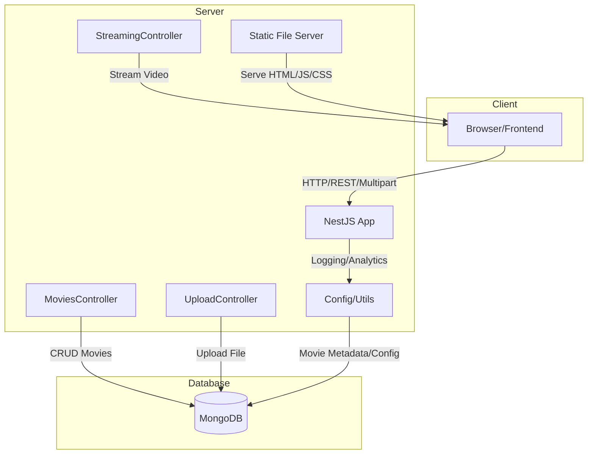

# Video Streaming App

## Overview

This project is a local video streaming server built with NestJS and MongoDB. It supports:

- Movie upload (large files, metadata)
- Video streaming with range requests
- Movie metadata management
- Directory listing
- Device connection logging

## Architecture Diagram

## Key Features

- Upload and stream large video files
- Store and manage movie metadata
- List movies from configured directories
- Secure and extensible backend

## Getting Started

1. Install dependencies: `bun install` or `npm install`
2. Start the server: `bun run start` or `npm run start`
3. Access endpoints via browser or API client

## Technologies Used

- NestJS (TypeScript)
- MongoDB (Mongoose)
- Multer (file uploads)
- Docker (optional)

## Endpoints

- `GET /stream/movies/list` — List movies
- `POST /stream/upload/` — Upload movie file
- `GET /stream/movies/stream` — Stream movie file

## Notes

- For large uploads, chunked upload is recommended for production
- All paths and configs can be customized
- See source code for more details
